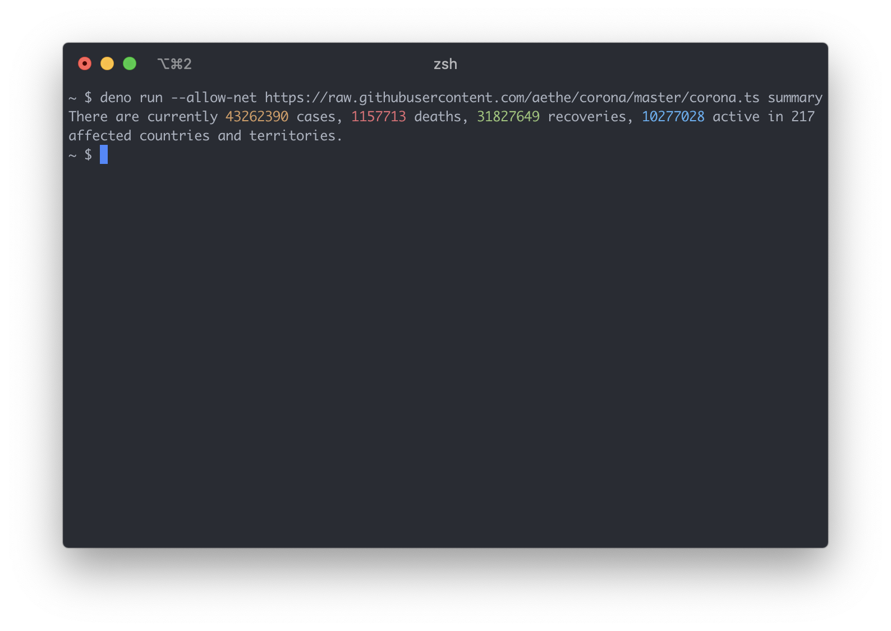
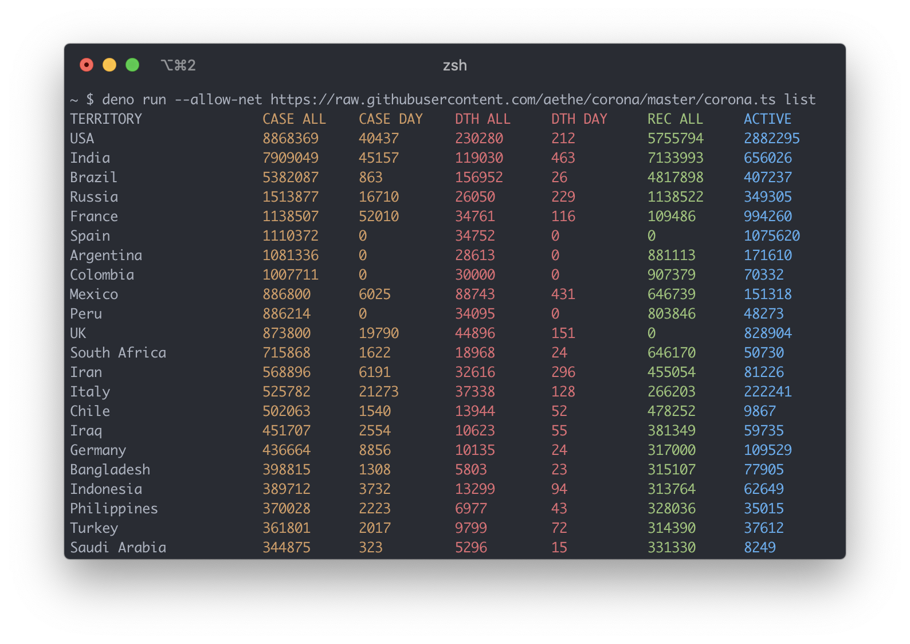
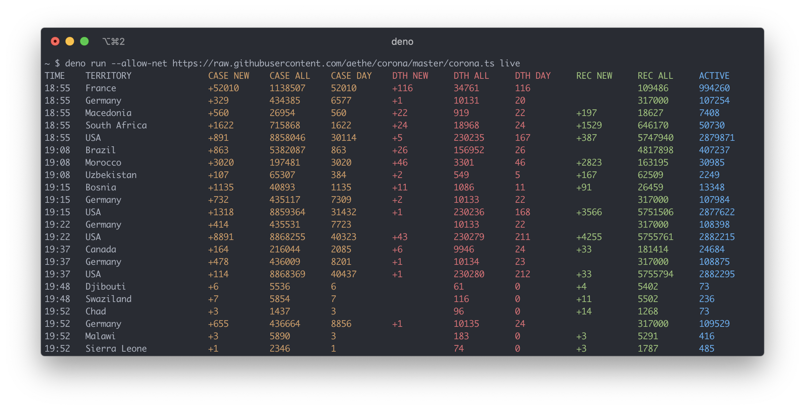
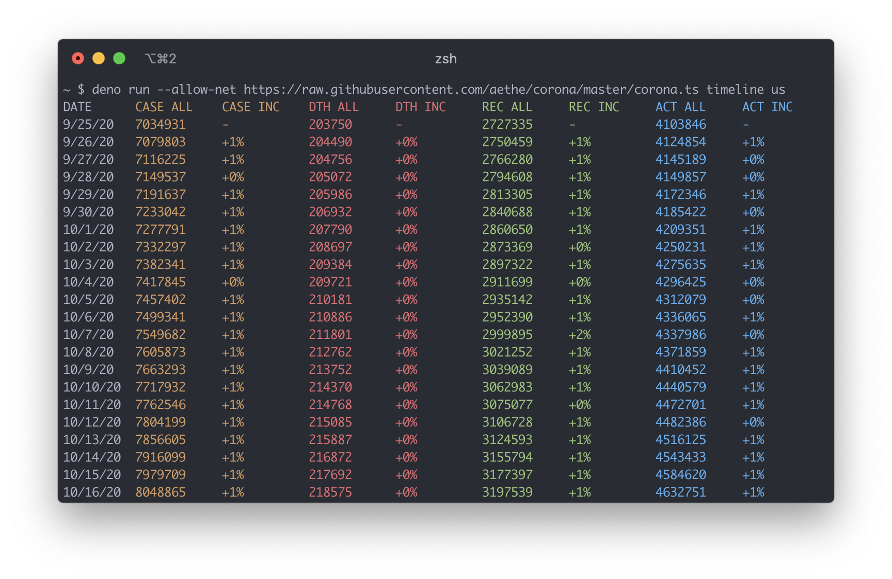
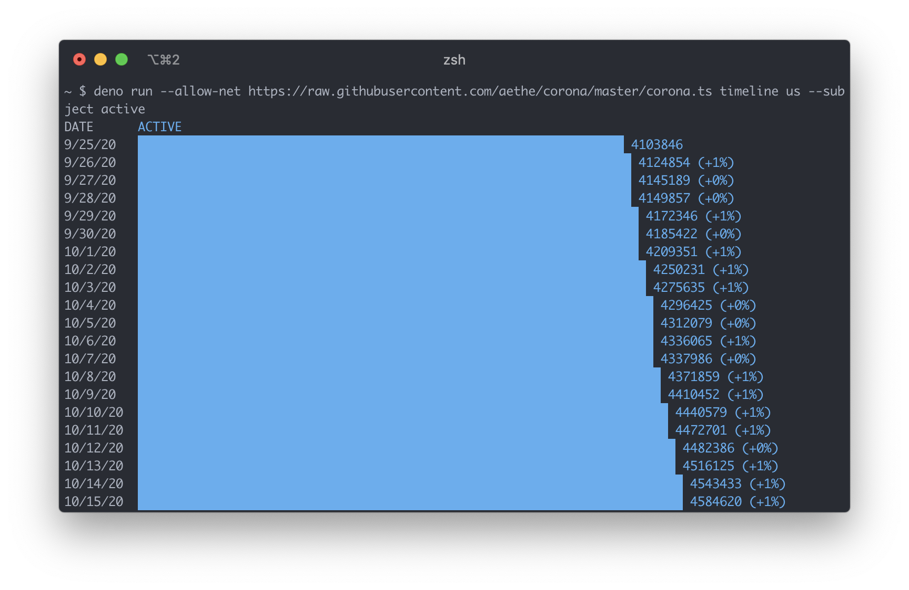

# Corona

CLI for tracking the ongoing pandemic of COVID-19.

## Source

Data is fetched from https://corona.lmao.ninja/v2/all, https://corona.lmao.ninja/v2/countries, and https://corona.lmao.ninja/v2/historical. I don't have any control over the data, nor am I responsible for any inaccuracies of the provided information. Refer to the [API repository](https://github.com/NovelCOVID/API) for more details.

## Installation

There is no installation required, but you need to have [Deno](https://deno.land) installed.

## Usage

### Summary

Renders the current data from all territories combined.

```
deno run --allow-net https://raw.githubusercontent.com/aethe/corona/master/corona.ts summary
```



### List

Renders a table with the current data per territory.

```
deno run --allow-net https://raw.githubusercontent.com/aethe/corona/master/corona.ts list
```

To sort the output, use the `--sort` argument with one of the following values: `cases`, `cases-today`, `deaths`, `deaths-today`, `recovered`, `active`. The default is `cases`.



### Live

Renders real-time updates.

```
deno run --allow-net https://raw.githubusercontent.com/aethe/corona/master/corona.ts live
```



### Timeline

Renders a timeline for a specific territory.

```
deno run --allow-net https://raw.githubusercontent.com/aethe/corona/master/corona.ts timeline china
```



To specify the length of the timeline to render, use the `--days` argument. The default is `30`.

To draw a graph for a specific subject, use the `--subject` argument with one of the following values: `cases`, `deaths`, `recovered`, `active`.


